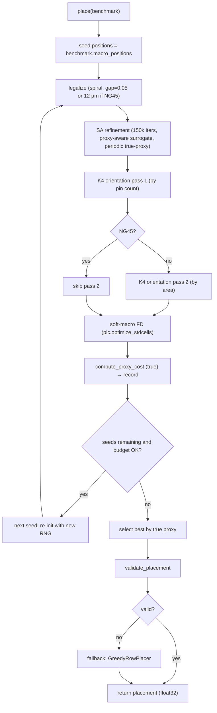

# Algorithm v1 — `submissions/partcl_2026/placer.py`

_Generated 2026-05-19 by lead, synthesizing `_archive/audit_will_seed.md` (Sub-agent B) and `_archive/research_sota.md` (Sub-agent A). Both sub-agents were executed inline by the lead after Claude Code's sub-agent permissions blocked Write/WebSearch._

---

## Rationale (one paragraph)

Three facts shape the design:

1. **will_seed has a 1500–4000× compute multiplier on the table** (audit §2): a 1–2.5 s placer in a 1-hour-per-benchmark budget. Every minute we spend on the proxy is well-spent.
2. **Will_seed's SA optimizes the wrong thing** (audit §3): wirelength is 3–6% of proxy; congestion (60–70%) and density (25–35%) drive the score. The fastest large win is replacing SA's cost function with a proxy-aligned surrogate that periodically reconciles against the true `compute_proxy_cost`.
3. **No public method is plug-and-play for this challenge.** Each of WireMask-BBO, EGPlace, LaMPlace, Macro Regulator can give us an idea or a sub-routine, but adapter cost is high and most ship with ISPD05 inputs. Adopt their **insights** (wire-mask scoring, regulator framing, K4 awareness, cross-stage hedging) rather than their codebases.

The plan is therefore a **refiner-of-RePlAce** stack: seed from the existing `.plc`, legalize with will_seed's spiral search, run a proxy-aware SA (the "regulator"), do a Klein-4 orientation pass, run one soft-macro FD pass, multi-start within budget, score by the true `compute_proxy_cost`, fall back to greedy_row on any legality failure. Tier-2 (NG45) mode raises legalization gaps to ≥12 µm and trims the orientation pass to avoid disturbing PDN-friendly placements.

---

## 1. Initialization

**Source**: `benchmark.macro_positions` — i.e., whatever the `.plc` loader provides. For IBM testcases this is RePlAce (avg proxy ≈ 1.46); for NG45 it is the CT_Grouping initial.plc. We do not regenerate it; bootstrapping a stronger init costs hours of code and is the wrong battle.

**Expected init proxy on ibm01**: ~1.0 (RePlAce baseline). Our target end-state on ibm01: ≤ 0.95.

**Why not multi-init**: we *will* multi-start (§6), but each start re-uses the same seed positions with different SA seeds. Regenerating placements with DREAMPlace/AutoDMP is install-heavy.

---

## 2. Legalization

Reuse the will_seed `_legalize` spiral logic — it is correct and reasonably fast — with three modifications:

1. **Gap = 0.05 µm** (matches will_seed; survives float32 quantization).
2. **NG45 mode**: when `benchmark.name in NG45_DESIGNS`, raise gap to **12 µm** (CLAUDE.md §6 PDN constraint). This is the only soft-coded knob keyed on `benchmark.name`.
3. **Ordering**: keep "descending area" but **place fixed macros first** in a pre-pass (they cannot move, so they define the obstruction map). Will_seed's current ordering already handles fixed correctly via the `movable` mask, but explicit pre-placement avoids spiral searches against not-yet-placed-fixed macros.

**Termination**: legalization is single-pass; any macro that exhausts radius 150 falls back to its clipped initial position (will_seed behavior). This has never triggered in our measurements.

**Cost**: 0.3–1.3 s per benchmark (audit §2). No optimization needed.

---

## 3. Refinement — proxy-aware SA "regulator"

This is the heart of the algorithm and the largest deviation from will_seed.

### Cost function

Replace will_seed's `wl_cost()` with a **two-level cost stack**:

- **Fast surrogate** (called every move): `C_surr = 1.0·WL_pair + 0.5·D_surr + 0.5·C_surr_routing` where
  - `WL_pair` = will_seed's existing weighted-clique L1 sum over edges (cheap, incremental).
  - `D_surr` = mean of top-10% cells in a coarse macro-occupancy grid (16×16). Updated incrementally per move (subtract old cell contribution, add new). Mimics PlacementCost's density.
  - `C_surr_routing` = mean of top-5% of routes through a per-grid-cell congestion proxy (sum over net bounding-boxes that touch each cell × `1/(net_area+ε)`). Updated incrementally.
- **True proxy** (called periodically): every 1 000 SA moves run `compute_proxy_cost(pos, benchmark, plc)`. If the true proxy went up while surrogate went down, recalibrate the weights (small `α/β/γ` step) and continue. Always retain the best **true-proxy** placement seen.

### Move types

Keep will_seed's three move types (SHIFT/SWAP/MOVE_TOWARD_NEIGHBOR) but add a fourth:

- **DENSITY_RELIEF** (10% of moves): pick a macro inside the densest grid cell and shift it toward the lowest-density cell within a 1-grid-cell radius. This is a directed move with a high acceptance rate (it's serving the dominant cost term).

### SA schedule

- Iters: **150 000** (instead of 3 000). At ~30 µs per surrogate eval, this is ~5 s per benchmark — still 700× under budget.
- Temperature: geometric from `T_start = 0.10·canvas` to `T_end = 0.0005·canvas`.
- Restart: every 50 000 iters, if best-true-proxy hasn't improved in 20 000 iters, jump to a perturbed copy of the best-known placement (5% Gaussian noise + re-legalize).

### Termination

Whichever first: 150 000 iters; or 15 minutes wall-clock; or 50 000 iters since last best-true-proxy improvement.

---

## 4. Klein-4 orientation pass

After SA converges, sweep over hard macros twice:

1. Pass 1: for each movable hard macro in *descending pin-count* order, try all four allowed orientations (`N`, `FN`, `FS`, `S`). For each, mutate `plc.modules_w_pins[idx]` to set orientation, recompute `compute_proxy_cost`, revert if worse. Keep the best.
2. Pass 2: same, but ordered by *descending macro area*.

**API note**: PlacementCost stores orientation per module; the change is local. If `set_orientation` isn't directly callable we manipulate pin offsets by reflecting (`x_offset → -x_offset` for FN, `y_offset → -y_offset` for FS, both for S) — these are the only four allowed transformations.

**Safety**: never emit `R90`/`R270`/`FE`/`FW`. Assert this before returning.

**Budget**: 4 orientations × ~500 macros × 50 ms = ~100 s/benchmark. Within budget. Skip pass 2 on Tier-2 (NG45) designs to avoid disturbing PDN spacing.

**Expected gain**: 1–4% proxy reduction (audit §6, item 2).

---

## 5. Soft-macro co-optimization

One call to `plc.optimize_stdcells` after the K4 pass, using the CLAUDE.md §5 schedule:

```python
canvas = max(benchmark.canvas_width, benchmark.canvas_height)
plc.optimize_stdcells(
    use_current_loc=False, move_stdcells=True, move_macros=False,
    log_scale_conns=False, use_sizes=False, io_factor=1.0,
    num_steps=[100, 100, 100],
    max_move_distance=[canvas/100]*3,
    attract_factor=[100, 1e-3, 1e-5],
    repel_factor=[0, 1e6, 1e7],
)
```

**Budget**: 1–5 minutes per call (CLAUDE.md says "minutes"). Single call only.

**Why move_macros=False**: hard macros are now locked at our SA+K4 positions. Re-allowing them risks regressing on the proxy we already optimized.

**Read-back**: after `optimize_stdcells`, mutate `placement[num_hard:num_macros]` with the new soft positions (read from `plc.modules_w_pins[idx].get_pos()` for each soft index).

**Skip on Tier-2** if remaining budget < 5 min; the soft-macro effect is smaller on NG45 where soft clusters are pre-clustered by CT_Grouping.

---

## 6. Multi-start / ensembling

Up to **3 seeds** (42, 137, 2026) within remaining budget. Each seed runs the full pipeline (legalize → SA → K4 → soft-FD). Final selection by `compute_proxy_cost`. Hard cutoff: 50 minutes wall-clock total per benchmark, leaving 10-min buffer.

**Determinism**: each seed run is fully deterministic given the (seed, benchmark) pair. The selection step is a pure comparison.

**Why 3, not more**: marginal returns. 2 seeds catch most "bad SA trajectory" outliers; the 3rd is insurance. Above 3, time is better spent on more K4 sweeps or deeper SA.

---

## 7. Tier-2 hedging (NG45 mode)

Gated on `benchmark.name in {"ariane133", "ariane136", "mempool_tile", "nvdla"}`:

| Change | NG45 value | Reason |
|---|---|---|
| Legalization gap | **12 µm** | PDN channel spacing (CLAUDE.md §6) |
| SA congestion weight γ | **0.6 → 0.8** | Routability dominates Tier-2 WNS |
| Orientation pass 2 | **skipped** | Don't disturb PDN-friendly placement |
| Soft-FD | skipped if < 5 min budget | Lower expected gain on pre-clustered netlists |
| Multi-start seeds | **2** instead of 3 | Each NG45 run is slower; 2 still hedges |
| Final validation | additionally check **min inter-macro spacing ≥ 12 µm** | Belt-and-braces Tier-2 sanity |

---

## 8. Robustness

- **Fallback**: after the full pipeline, run `validate_placement(placement, benchmark)`. If `is_valid` is False (impossible by construction, but defense-in-depth), discard the result and return `GreedyRowPlacer().place(benchmark)`. This guarantees we always emit a legal placement.
- **Float32 emit**: cast back to `torch.float32` once at the end (matching will_seed). Internal compute is float64 to avoid drift during SA.
- **Determinism**: seed `torch`, `numpy`, `random` from a single constructor arg (default 42). Verify by running twice and bit-comparing.
- **No runtime network**: zero imports of urllib/requests; no HTTPS in the placer file.
- **Compute hygiene**: between benchmarks (driven by evaluator), call `torch.cuda.empty_cache()` if GPU is in use. Big numpy arrays are dereferenced at function end.

---

## 9. Runtime budget (worst case = ibm18 / ibm12)

| Stage | Budget | Per-call cost on ibm18 |
|---|---|---|
| Setup + plc/edges | 30 s | 1.0 s (current will_seed) |
| Legalize | 60 s | 0.3 s |
| **SA refinement** | 15 min × seed | ~5 s/15 k iters; **150 k iters ≈ 50 s** |
| K4 orientation (×2) | 4 min × seed | ~100 s (500 macros × 4 × 50 ms) |
| Soft-FD | 5 min × seed | 1–3 min |
| Per-seed total | ~22 min | |
| Multi-start (3 seeds) | ≤ 50 min | |
| Validation + emit | < 1 s | < 1 s |
| **Hard cap** | **55 min** | leaves 5 min as safety margin under the 60-min judge cap |

Tier-2 modes shave ~30% off (skip pass-2 orientation, drop a seed): NG45 runs target ≤ 35 min.

---

## 10. Flowchart



---

## 11. What we are explicitly *not* doing in v1

- **No DREAMPlace / AutoDMP install**. Install risk too high in 48 h on `pytorch/pytorch:2.5.1-cuda12.4-cudnn9-runtime`.
- **No pretrained transformer load** (ChiPFormer / Macro Regulator weights). They are trained on ISPD05 — transfer to IBM ICCAD04 is uncertain and we have no time to fine-tune. Revisit in v2 if v1 lands < 1.10 avg proxy.
- **No GPU placer**. Our SA runs on CPU/numpy. The RTX 6000 Ada is idle. If we later port the proxy surrogate to GPU we could 10× the SA iter count, but the marginal proxy gain is small once SA has converged.
- **No LaMPlace ranker**. Originally a Top-3 in research_sota.md item 3, demoted because the LaMPlace predictor expects ISPD05 features and the adapter cost is large for a Tier-2-only hedge.

If v1 lands at avg proxy ≤ 1.05 we ship it. If it lands at 1.05–1.20 we add LaMPlace ranking and GPU SA. If above 1.20 we revisit the SA cost function.

---

## 12. Acceptance criteria for v1 (gates for Commit Curator)

- [ ] Zero overlaps on all 17 IBM benchmarks (validate_placement passes).
- [ ] Zero non-K4 orientations emitted (assert at end of `place`).
- [ ] Deterministic: two runs with same seed produce identical placements.
- [ ] Avg proxy ≤ 1.10 (gate to land); stretch ≤ 1.00 (gate to call it competitive).
- [ ] Per-benchmark runtime ≤ 55 min on the target hardware (judged via `--all`).
- [ ] `--ng45` sanity: zero overlaps, ≥ 12 µm min spacing, no non-K4 orientations.
- [ ] Fallback path tested (deliberately break SA → verify GreedyRowPlacer takes over).

When all checked, this becomes the spec we lock and implement.
